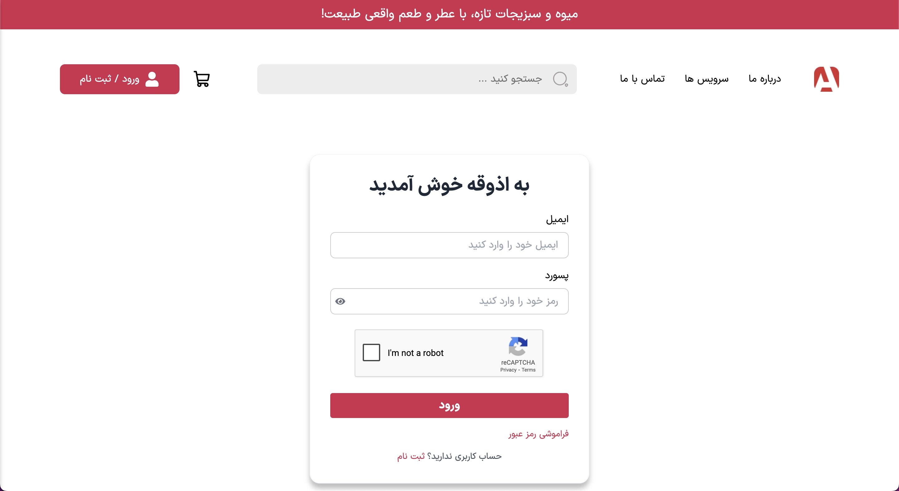
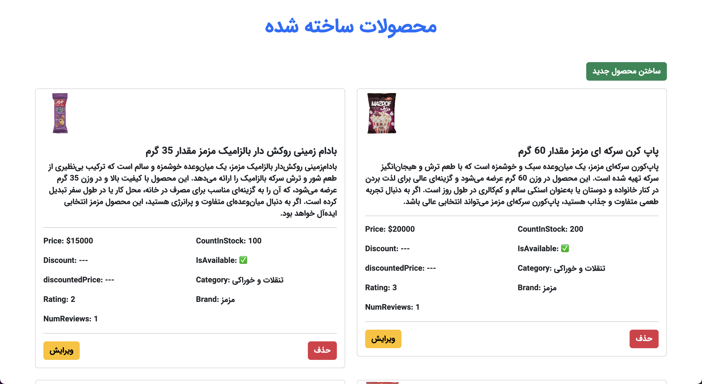
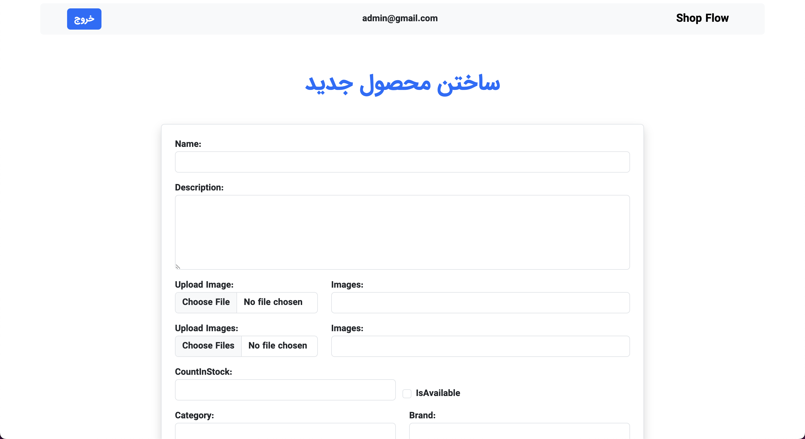
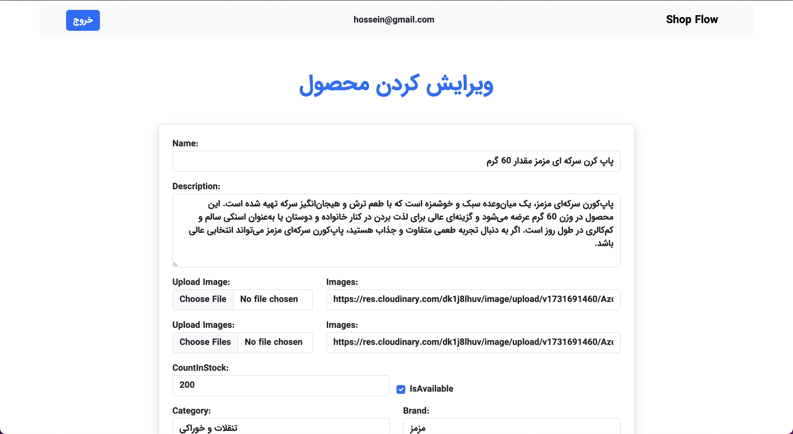

# Shop Flow

Shop Flow is a backend service built with Node.js and Express, designed to handle authentication, user management, and data storage using MongoDB. It includes security features, file uploads, and API documentation via Swagger.

## Features

- **Authentication & Authorization:** Uses JWT and bcrypt for secure user authentication.
- **Database:** MongoDB with Mongoose for flexible and scalable data handling.
- **File Uploads:** Supports Cloudinary and Multer for handling media files.
- **Security Enhancements:** Includes Helmet, CORS, XSS protection, rate limiting, and more.
- **Logging & Debugging:** Integrated with Morgan for request logging.
- **Swagger API Documentation:** Provides a clear and structured API reference.
- **Templating Engine:** Uses Pug for rendering dynamic pages.

## Frontend Projects Using This API

Here are the frontend projects currently using this API:

### Azoghe

- 🌐 [Visit Azoghe](https://azogeh.onrender.com)
- 🔗 [Azoghe Repository](https://github.com/m-mohammad-d/azogeh)

  
  
  
  

## CMS for Shop Flow

To help frontend developers set up their initial database data, a CMS has been developed:

  
  
  
  

## License

This project is licensed under the MIT License.
