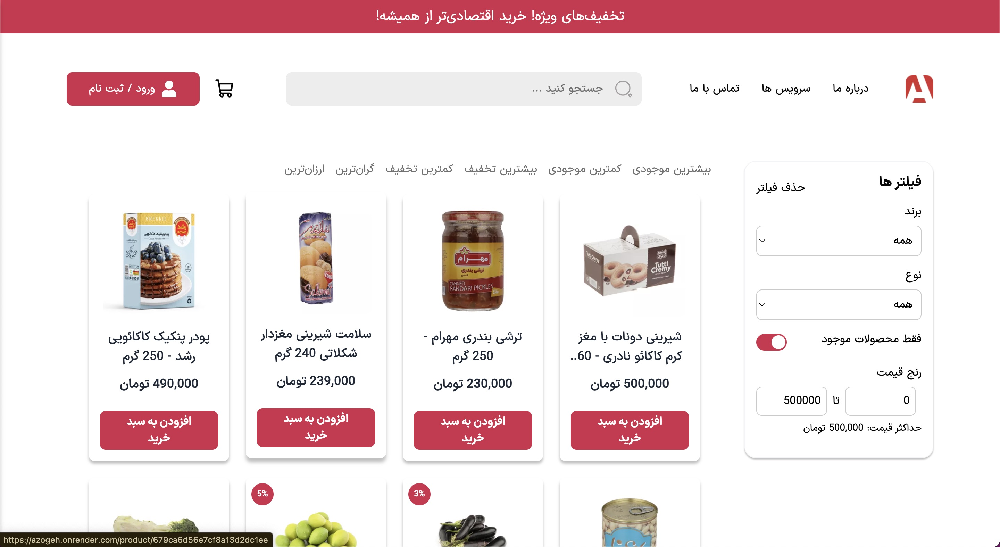

# Shop Flow - E-commerce API Documentation

A comprehensive e-commerce API built with Node.js, Express, TypeScript, and MongoDB, featuring JWT authentication, role-based authorization, and a clean architecture pattern.

## 📚 Documentation Index

This project includes comprehensive documentation covering all aspects of the system:

### Core Documentation

1. **[Project Structure & Architecture](docs/PROJECT_STRUCTURE.md)**

   - Clean Architecture implementation
   - Domain-Driven Design patterns
   - Dependency injection setup
   - File organization and naming conventions

2. **[Authentication & Authorization](docs/AUTHENTICATION.md)**

   - JWT-based authentication flow
   - Refresh token rotation
   - Role-based access control (RBAC)
   - Security mechanisms and best practices

3. **[Error Handling System](docs/ERROR_HANDLING.md)**

   - Custom error classes hierarchy
   - Global error handler implementation
   - Consistent error response formats
   - Localized error messages (Persian)

4. **[Middleware System](docs/MIDDLEWARE_SYSTEM.md)**

   - Authentication and authorization middleware
   - Security middleware (XSS, CORS, Rate limiting)
   - Validation middleware integration
   - Domain-specific middleware patterns

5. **[API Documentation](docs/API_DOCUMENTATION.md)**

   - Swagger/OpenAPI 3.0 specification
   - Interactive API documentation
   - Request/response schemas
   - Authentication examples

6. **[Testing Strategy](docs/TESTING_STRATEGY.md)**
   - Integration testing approach
   - Jest and Supertest configuration
   - Test helpers and utilities
   - Database testing with MongoDB Memory Server

## 🚀 Quick Start

### Prerequisites

- Node.js (v18 or higher)
- MongoDB
- npm or yarn

### Installation

```bash
# Clone the repository
git clone <repository-url>
cd shop-flow

# Install dependencies
npm install

# Set up environment variables
cp .env.example .env
# Edit .env with your configuration

# Start development server
npm run start:dev
```

### Environment Variables

```env
# Database
MONGO_URI=mongodb://localhost:27017/shop-flow

# JWT Configuration
JWT_SECRET=your_access_token_secret
JWT_EXPIRES_IN=15m
JWT_REFRESH_SECRET=your_refresh_token_secret
JWT_REFRESH_EXPIRES_IN=7d

# Email Configuration
EMAIL_FROM=noreply@shopflow.com
EMAIL_HOST=smtp.gmail.com
EMAIL_PORT=587
EMAIL_USERNAME=your_email@gmail.com
EMAIL_PASSWORD=your_app_password

# Cloudinary (for image uploads)
CLOUDINARY_CLOUD_NAME=your_cloud_name
CLOUDINARY_API_KEY=your_api_key
CLOUDINARY_API_SECRET=your_api_secret

# Application
NODE_ENV=development
PORT=3000
```

## 🏗️ Architecture Overview

Shop Flow follows a **Clean Architecture** pattern with **Domain-Driven Design** principles:

```
src/
├── app/           # Application layer (configuration, routes)
├── core/          # Domain layer (business logic)
│   ├── users/     # User domain
│   ├── products/  # Product domain
│   ├── orders/    # Order domain
│   ├── reviews/   # Review domain
│   └── uploads/   # Upload domain
├── middlewares/   # Infrastructure layer (cross-cutting concerns)
├── errors/        # Custom error classes
├── utils/         # Utility functions
└── __tests__/     # Test suite
```

### Key Features

- **JWT Authentication** with refresh token rotation
- **Role-based Authorization** (User, Admin)
- **Input Validation** with express-validator
- **Error Handling** with custom error classes
- **File Upload** with Cloudinary integration
- **API Documentation** with Swagger UI
- **Testing** with Jest and Supertest
- **Security** with Helmet, CORS, Rate limiting
- **Database** with Mongoose ODM

## 📖 API Endpoints

### Authentication

- `POST /api/users/signup` - User registration
- `POST /api/users/login` - User login
- `POST /api/users/logout` - User logout
- `POST /api/users/forgot-password` - Password reset request
- `PATCH /api/users/reset-password` - Password reset
- `POST /api/users/refresh-token` - Token refresh

### User Management

- `GET /api/users/get-me` - Get current user profile
- `PATCH /api/users/update-me` - Update user profile
- `PATCH /api/users/update-me-password` - Change password
- `DELETE /api/users/delete-me` - Delete user account

### Products

- `GET /api/products` - Get all products (with filtering, sorting, pagination)
- `GET /api/products/:id` - Get product by ID
- `POST /api/products` - Create product (Admin only)
- `PATCH /api/products/:id` - Update product (Admin only)
- `DELETE /api/products/:id` - Delete product (Admin only)

### Orders

- `GET /api/orders/get-myorders` - Get current user's orders
- `GET /api/orders/:id` - Get order by ID
- `POST /api/orders` - Create new order
- `PATCH /api/orders/:id/pay` - Mark order as paid
- `GET /api/orders` - Get all orders (Admin only)
- `PATCH /api/orders/:id` - Update order (Admin only)
- `DELETE /api/orders/:id` - Delete order (Admin only)
- `PATCH /api/orders/:id/deliver` - Mark order as delivered (Admin only)

### Reviews

- `GET /api/products/:productId/reviews` - Get product reviews
- `POST /api/products/:productId/reviews` - Create review
- `GET /api/products/:productId/reviews/:id` - Get review by ID
- `PATCH /api/products/:productId/reviews/:id` - Update review
- `DELETE /api/products/:productId/reviews/:id` - Delete review

### File Uploads

- `POST /api/uploads` - Upload image file

### Admin Endpoints

- `GET /api/users` - Get all users (Admin only)
- `POST /api/users` - Create user (Admin only)
- `GET /api/users/:id` - Get user by ID (Admin only)
- `PATCH /api/users/:id` - Update user (Admin only)
- `DELETE /api/users/:id` - Delete user (Admin only)
- `GET /api/users/get-users-count` - Get user statistics (Admin only)

## 🔐 Authentication Flow

1. **User Registration/Login**: User submits credentials
2. **Token Generation**: JWT access token (15 min) + refresh token (7 days)
3. **Token Storage**: Tokens stored in httpOnly cookies + headers
4. **Request Authentication**: Middleware validates tokens on protected routes
5. **Token Refresh**: Automatic token refresh when access token expires
6. **Logout**: Tokens cleared from cookies and database

## 🛡️ Security Features

- **JWT Authentication** with separate access/refresh tokens
- **Password Hashing** with bcrypt
- **Input Sanitization** against XSS and NoSQL injection
- **Rate Limiting** to prevent abuse
- **CORS Configuration** for cross-origin requests
- **Helmet** for security headers
- **HTTP Parameter Pollution** protection

## 🧪 Testing

The project uses **Jest** with **Supertest** for integration testing:

```bash
# Run all tests
npm test

# Run tests in watch mode
npm run test:watch

# Run tests with coverage
npm run test:coverage
```

### Test Structure

- **Integration Tests**: End-to-end API testing
- **Test Helpers**: Reusable test utilities
- **In-Memory Database**: MongoDB Memory Server for isolation
- **Mock Services**: External service mocking

## 📊 API Documentation

Interactive API documentation is available at:

- **Development**: `http://localhost:3000/api-docs`
- **Production**: `https://your-domain.com/api-docs`

The documentation includes:

- Complete endpoint specifications
- Request/response schemas
- Authentication examples
- Interactive testing interface

## 🌐 Frontend Projects Using This API

Here are the frontend projects currently using this API:

### Azoghe

- 🌐 [Visit Azoghe](https://azogeh.onrender.com)
- 🔗 [Azoghe Repository](https://github.com/m-mohammad-d/azogeh)

<p>
  
  
  
  
</p>

## 🛠️ CMS for Shop Flow

To help frontend developers set up their initial database data, a CMS has been developed:

<p>
  
  
  
  
</p>

## 🚀 Deployment

### Production Build

```bash
# Build the application
npm run build

# Start production server
npm start
```

### Environment Setup

Ensure all environment variables are properly configured for production:

- Use strong JWT secrets
- Configure proper CORS origins
- Set up email service credentials
- Configure Cloudinary for file uploads
- Use production MongoDB instance

## 🤝 Contributing

1. Fork the repository
2. Create a feature branch (`git checkout -b feature/amazing-feature`)
3. Commit your changes (`git commit -m 'Add some amazing feature'`)
4. Push to the branch (`git push origin feature/amazing-feature`)
5. Open a Pull Request

### Development Guidelines

- Follow the existing code structure and patterns
- Write tests for new features
- Update documentation as needed
- Follow TypeScript best practices
- Use meaningful commit messages

## 📝 License

This project is licensed under the ISC License - see the [LICENSE](licence) file for details.

## 👨‍💻 Author

**Hossein Rezaei**

- Email: rezaeig22@gmail.com
- Telegram: [@h3nrzi](https://t.me/h3nrzi)

---

For detailed information about any aspect of the system, please refer to the specific documentation files listed above. Each document provides comprehensive coverage of its respective topic with examples, best practices, and implementation details.
